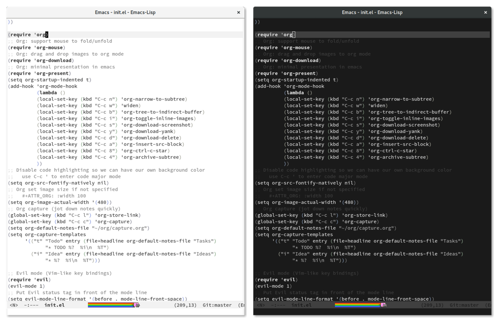

# minimal-theme.el

A dark/light minimalistic theme for Emacs. Look nice with Nyan mode.

## Differences of this fork

- Mode Line: Use dark mode line in dark theme. 
- Org Mode: Same font size for all headers. And other minor tweaks.

## License

GPLv3
